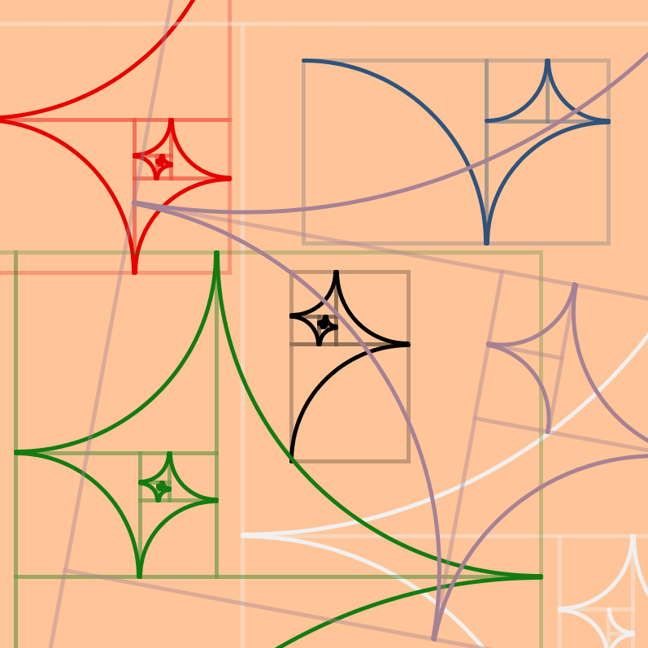

# processing-fibonacci-spirals

## Concept

Connected squares/curves that form a shape similar to the Fibonacci spiral, except with inverted curves as the unit.

## Usage

Navigate to ```fibonaccispirals/fibonaccispirals.pde``` and open with the Processing IDE.

Run in the Processing IDE or export to application and execute.

## Demo Image


